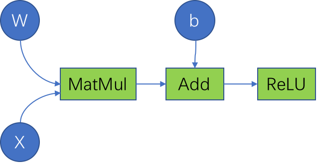
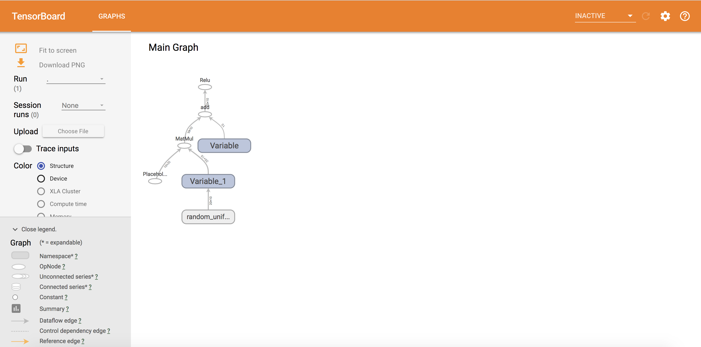
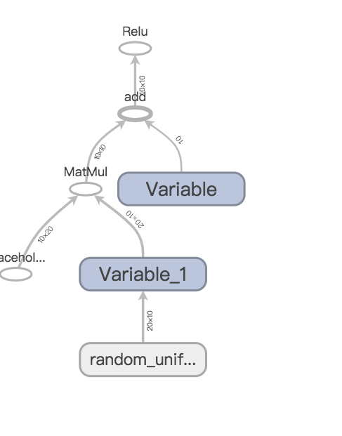

Tensorflow is a high performance numerical computation software library, it is mostly known for its strong support for machine learning and deep learning.

### How to Install

If you have ‘pip’, everything is simple
`pip install tensorflow`

### Basic Concepts

> Graph  

Graph is a fundamental concept in Tensorflow. Take ReLU computation as an example, the function of ReLU is 

*h=ReLU(Wx+b)*

In the view of Tensorflow, the function looks like this



> Nodes  

Variables such as *W* and *b* , placeholders such as x, are operations such as *MatMul*, *Add* are all nodes in the graph.


> Edges  
>   
The edges between nodes indicate the data which flow between nodes,  in tensorflow data is represented as “tensor” .  

“tensor” + “flow”  = “tensorflow”


### Codes 


```
import tensorflow as tf
import numpy as np

if __name__ == '__main__':

	b = tf.Variable(tf.zeros((10,)))
	W = tf.Variable(tf.random_uniform((20, 10), -1, 1))

	x = tf.placeholder(tf.float32, (10, 20))

	h = tf.nn.relu(tf.matmul(x, W) + b)

	writer = tf.summary.FileWriter('./graphs', tf.get_default_graph())

	with tf.Session() as sess:
		sess.run(tf.global_variables_initializer())	
		sess.run(h, {x: np.random.random((10, 20))})

	writer.close()

```

Here are the steps showed in the codes above.

1. Create a graph using Variables and placeholders.
2. Start a tensorflow session and deploy the graph into the session.
3. Run the session, let the tensors flow.
4. Write processing logs using tools such as tf.summary.

Session is the so called execution environment. It needs two parameters which are “Fetches” and “Feeds”.

`sess.run(fetches, feeds)`

Fetches: List of graph nodes

Feeds: Dictionary mapping from graph nodes to concrete values.

In the ReLU example, Fetches = h = tf.nn.relu(tf.matmul(x, W) + b) , Feeds = {x: np.random.random((10, 20))}

It would be interesting to see what happened during the running time. TensorBoard is a convenient way.


## TensorBoard Result






The Main Graph clearly shows how the tensor flows through the graph. In a complex machine learning program, the printed graph would be a convenient tool to increase confidence of the result.

#Research